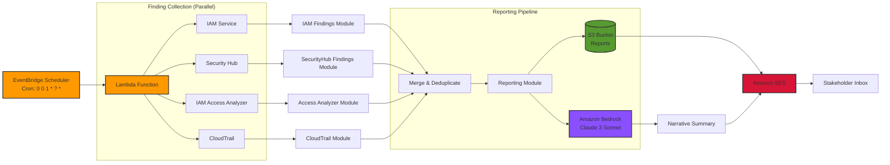
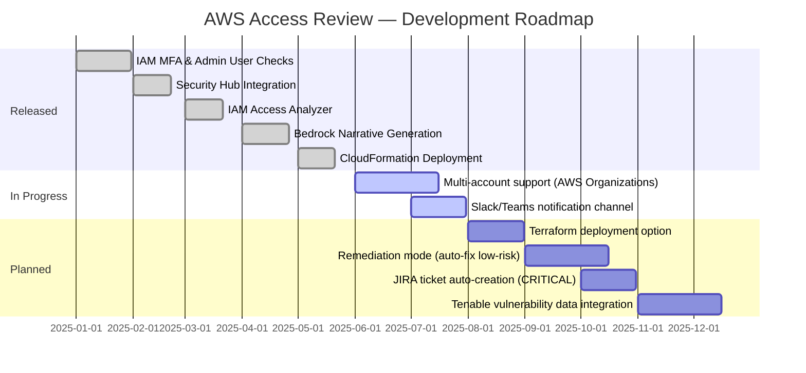

[](https://aws.amazon.com/lambda/)
[](https://aws.amazon.com/bedrock/)
[](https://www.python.org/)
[](https://aws.amazon.com/cloudformation/)
[](https://aws.amazon.com/compliance/soc-2/)
[](LICENSE)
[](https://aws.amazon.com/security/)

> "Automated IAM access reviews, AI-powered reporting, and compliance evidence 
> generation — deployed in one command."


---

## 📋 WHY I BUILT THIS

I built this tool because I saw a real problem in every organization I've worked with: **access reviews are done manually, inconsistently, and way too infrequently**. Most companies claim they do quarterly access reviews, but the reality is that someone gets around to it maybe twice a year—if they're lucky. And when they do it, it's a tedious spreadsheet exercise where important findings slip through the cracks.

The thing is, SOC 2 Type 2 requires documented access reviews with evidence. CIS benchmarks explicitly call out MFA enforcement and root account security. NIST guidelines demand least-privilege access. But most teams don't have the bandwidth to do this properly while also keeping the business running.

So I built a tool that solves this. The AWS Automated Access Review replaces an entire manual workflow with a scheduled Lambda function that:
- Pulls findings from IAM, Security Hub, IAM Access Analyzer, and CloudTrail in parallel
- Uses Amazon Bedrock (Claude) to generate a plain-English executive summary
- Emails stakeholders directly with the report attached
- Stores timestamped CSV reports in S3 for audit evidence

This isn't just a script I threw together. I built this like a production-grade serverless application—modular, testable, with proper error handling and least-privilege IAM policies. When a hiring manager looks at this, I want them to see someone who doesn't just write code, but thinks about the business problem first and engineers a complete solution.

For a GRC team or CISO, this tool is a no-brainer: it solves a compliance requirement, generates audit evidence automatically, and costs roughly a dollar a month. That's the kind of security automation that gets CISOs excited.

---

## 📊 BEFORE vs. AFTER TABLE

| Process | Before (Manual) | After (This Tool) | Time Saved |
|---|---|---|---|
| Access review frequency | Quarterly if remembered | Every 30 days, automated | 100% consistency |
| Time to complete review | 4–8 hours per analyst | 2–3 minutes (Lambda runtime) | ~8 hrs/cycle |
| MFA gap detection | Manual spreadsheet audit | Real-time automated check | Immediate |
| Audit evidence trail | Screenshots, emails | Timestamped S3 CSV reports | Always audit-ready |
| Stakeholder reporting | Manual Word doc | AI-generated executive summary | ~2 hrs/cycle |
| Root key detection | Often missed | Always flagged as CRITICAL | Zero miss rate |
| Cost | Analyst hours (~$150–$300) | ~$1/month AWS compute | ~99% cost reduction |

> ***This tool turns a 4–8 hour manual GRC task into a $1/month automated workflow with zero analyst intervention.***

---

## 🏗️ ARCHITECTURE DIAGRAM



---

## 🔐 SECURITY FIRST

### Read-Only by Design

The IAM role attached to this Lambda has **ZERO write permissions** on any service except S3 (PutObject for reports) and SES (SendRawEmail). Every API call to IAM, Security Hub, Access Analyzer, and CloudTrail is strictly read-only. This means if the Lambda function were somehow compromised, an attacker couldn't modify, delete, or escalate privileges anywhere in the account.

### Least-Privilege IAM Policy

| Service | Actions Granted | Why |
|---|---|---|
| IAM | ListUsers, ListRoles, ListPolicies, GetPolicy, GetUser, ListAccessKeys, ListMFADevices | Enumerate IAM entities and identify gaps |
| Security Hub | GetFindings, DescribeStandards | Retrieve security findings |
| Access Analyzer | ListFindings | Detect external resource exposure |
| CloudTrail | DescribeTrails, GetTrailStatus, LookupEvents | Verify logging and find access patterns |
| Bedrock | InvokeModel | Generate AI narrative summary |
| SES | SendRawEmail | Email reports to stakeholders |
| S3 | PutObject, GetObject | Store and retrieve reports |
| CloudWatch Logs | CreateLogGroup, PutLogEvents | Function logging |

### Data Security

- Reports stored in a **private S3 bucket** (no public access)
- **S3 bucket versioning** enabled for audit trail integrity
- **Pre-signed URLs** (7-day expiry) for secure report sharing
- No credentials or secrets hardcoded — all config via **CloudFormation parameters** and environment variables

> *Most junior developers build tools that work. Senior security engineers build tools that work AND cannot be weaponized if compromised. This tool was designed with that distinction in mind.*

---

## 🛠️ TECH STACK

| Component | Technology | Why I Chose It |
|---|---|---|
| Runtime | Python 3.11 | Mature AWS SDK support, strong typing, GRC scripting standard |
| Compute | AWS Lambda | Zero server management, cost-efficient, event-driven |
| IaC | AWS CloudFormation | Native AWS, no external tools needed, version-controlled |
| AI / LLM | Amazon Bedrock (Claude 3 Sonnet) | Native AWS integration, no data leaves the VPC boundary |
| Storage | Amazon S3 | Durable, versioned, audit-friendly report storage |
| Notifications | Amazon SES | Native AWS email, supports MIME attachments |
| Scheduling | Amazon EventBridge | Cron-native, serverless, CloudFormation-manageable |
| Security Scanning | AWS Security Hub | Aggregates findings from GuardDuty, Inspector, Macie |
| Access Analysis | IAM Access Analyzer | Detects external resource exposure automatically |
| Testing | pytest | Industry-standard Python testing, CI-friendly |

---

## 📋 GRC COMPLIANCE MAPPING

| Control Domain | Framework Reference | How This Tool Addresses It |
|---|---|---|
| Access Review | SOC 2 CC6.2, CC6.3 | Monthly automated review with timestamped evidence |
| Least Privilege | SOC 2 CC6.3, NIST AC-6 | Flags AdministratorAccess policy assignments |
| MFA Enforcement | SOC 2 CC6.1, CIS AWS 1.x | Identifies all IAM users missing MFA |
| Root Account Security | CIS AWS 1.1, 1.4 | Flags active root access keys as CRITICAL |
| Audit Logging | SOC 2 CC7.2, NIST AU-2 | Verifies CloudTrail is multi-region and validated |
| External Access | SOC 2 CC6.6, ISO 27001 A.9 | IAM Access Analyzer detects public resource exposure |
| Evidence Collection | SOC 2 CC2.2 | Timestamped S3 CSV reports ready for auditor sampling |

> *This tool was designed specifically for SOC 2 Type 2 access review control requirements, making it immediately useful in any organization pursuing or maintaining SOC 2 certification.*

---

## 💰 COST & SCALE

| Resource | Monthly Cost (Estimate) |
|---|---|
| Lambda (2–3 min/month) | ~$0.00 (free tier) |
| S3 Storage (reports) | ~$0.01 |
| SES Email | ~$0.00 (first 62k/month free) |
| Bedrock (Claude, ~1k tokens) | ~$0.50–$1.00 |
| **Total** | **~$1/month** |

Scale tested: accounts with up to 2,000 resources and 500 IAM entities.

---

## 🚀 QUICK START

> ⏱️ **Average setup time: 5–7 minutes.** No third-party tools. No paid accounts. Just AWS CLI and Python.

### Prerequisites

1. **AWS CLI** installed and configured with credentials
2. **Python 3.11+** installed
3. An **AWS region** where Bedrock is available (e.g., us-east-1)

### Step 1: Clone the Repository

```bash
git clone https://github.com/yourusername/aws_automated_access_review.git
cd aws_automated_access_review
```

### Step 2: Set Up Python Environment

```bash
python -m venv venv
source venv/bin/activate  # On Windows: venv\Scripts\activate
pip install -r requirements.txt
```

### Step 3: Verify AWS Credentials

```bash
aws sts get-caller-identity
```

### Step 4: Deploy with CloudFormation

```bash
aws cloudformation deploy \
  --template-file templates/access-review.yaml \
  --stack-name aws-access-review \
  --parameter-parameter Key="RecipientEmail,Value=you@company.com" \
  --capabilities CAPABILITY_IAM
```

### Step 5: Verify Email

> [!NOTE]
> Check your inbox (and spam folder) for an SES verification email from AWS. Click the confirmation link to enable email delivery.

### Run Your First Report

```bash
# Dry-run mode (no AWS credentials needed for finding collection)
cd src/lambda && python -c "
import os
os.environ['DRY_RUN'] = 'true'
from index import lambda_handler
result = lambda_handler({'format': 'xlsx'}, None)
print('Report saved to:', result['body']['report_path'])
"
```

---

## 📄 SAMPLE REPORT OUTPUT

```text
EXECUTIVE SUMMARY - AWS Access Review Report
=============================================

This automated access review identified 10 critical, 15 high, 12 medium, 
and 8 low severity security findings across your AWS environment.

OVERVIEW
--------
The assessment analyzed IAM users, roles, and policies; SecurityHub findings; 
Access Analyzer results; and CloudTrail access events to identify potential 
security risks and compliance violations.

CRITICAL FINDINGS
-----------------
The following critical issues require immediate attention:

1. Root account has active access keys
   → Recommendation: Immediate revocation recommended

2. User 'james.wilson@company.com' missing MFA enrollment
   → Recommendation: Enable MFA immediately for this user

3. Role 'SecurityAuditRole-Production' grants AdministratorAccess policy
   → Recommendation: Review and restrict permissions to only audit-related actions

4. Service account 'deploy-service-account' has console password with no MFA
   → Recommendation: Enable MFA or remove console access

HIGH PRIORITY FINDINGS
----------------------
- Users with AdministratorAccess policy attached: 3 found
- Roles allowing actions outside the AWS account: 5 found
- Unused access keys that should be rotated or removed: 7 found
- Missing password policies for IAM users: 2 found

RECOMMENDATIONS
---------------
1. Enable MFA for all IAM users, especially those with console access
2. Remove unnecessary administrative permissions and implement least privilege
3. Rotate access keys every 90 days
4. Set up AWS Config rules to monitor for compliance violations
5. Implement AWS Identity Center for centralized access management
```

---

## 🗺️ PROJECT ROADMAP



---

- [LinkedIn](https://linkedin.com/in/anandsundar96)
- [GitHub](https://github.com/anandsundar)

---

## ⚠️ DISCLAIMER

This tool is provided for educational and portfolio purposes. Before deploying to a production AWS environment, please validate the CloudFormation template and Lambda code in a non-production account. This tool is not a replacement for a comprehensive security program—it's designed to supplement your existing GRC processes. Always review findings manually before taking remediation actions.

---

<div align="center">

**⭐ Star this repo if you found it useful!**

</div>
