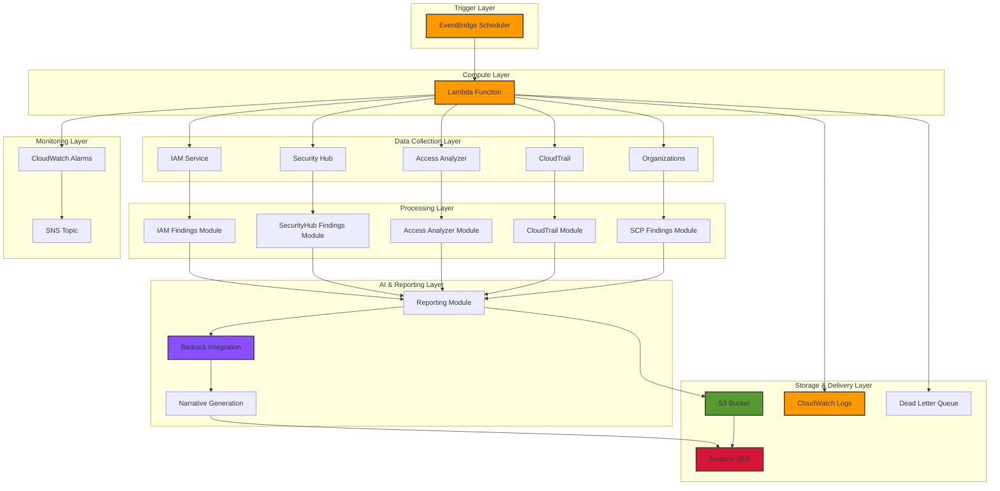
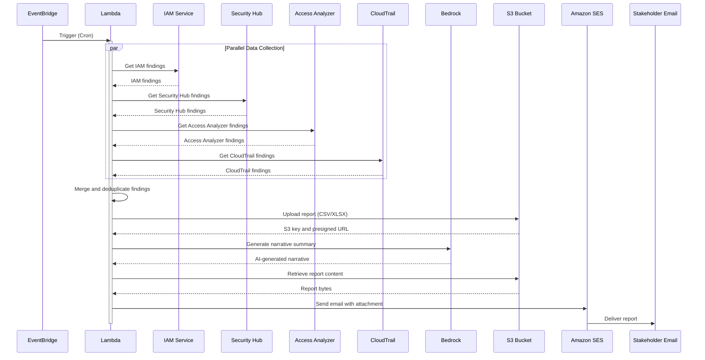

# System Architecture

## Overview

The AWS Automated Access Review is a serverless application designed to automate the process of reviewing IAM access, detecting security findings, and generating compliance reports. The system is built on AWS Lambda and leverages multiple AWS services to collect, analyze, and report on security posture.

## High-Level Architecture



## Component Descriptions

### 1. Trigger Layer

#### EventBridge Scheduler
- **Purpose**: Triggers the Lambda function on a scheduled basis
- **Configuration**: Cron expression (default: monthly on the 1st at midnight)
- **Benefits**: Serverless, reliable, no infrastructure to manage
- **Customization**: Can be modified to run daily, weekly, or on-demand

### 2. Compute Layer

#### Lambda Function
- **Runtime**: Python 3.11
- **Timeout**: 300 seconds (5 minutes)
- **Memory**: 512 MB
- **Concurrency**: Reserved concurrency of 1 to prevent duplicate executions
- **Tracing**: AWS X-Ray enabled for performance monitoring
- **Error Handling**: Dead Letter Queue (SQS) for failed invocations

**Key Features**:
- Parallel execution of finding collection modules
- Automatic retry logic with exponential backoff
- Dry-run mode for testing without AWS API calls
- Comprehensive logging to CloudWatch

### 3. Data Collection Layer

#### IAM Service Integration
- **Purpose**: Collect IAM user, role, and policy information
- **Permissions**: Read-only (Get*, List*)
- **Data Collected**:
  - Users and their MFA status
  - Access keys and their last used dates
  - Roles and attached policies
  - Password policies
  - Root account status

#### Security Hub Integration
- **Purpose**: Aggregate security findings from multiple AWS services
- **Permissions**: GetFindings, BatchGetFindings
- **Data Collected**:
  - GuardDuty findings
  - Inspector findings
  - Macie findings
  - Custom security standards

#### IAM Access Analyzer Integration
- **Purpose**: Detect resources shared with external entities
- **Permissions**: ListAnalyzers, ListFindings, GetFinding
- **Data Collected**:
  - Public S3 buckets
  - External role trust relationships
  - Shared resources across accounts

#### CloudTrail Integration
- **Purpose**: Verify logging configuration and analyze access patterns
- **Permissions**: DescribeTrails, GetTrailStatus, LookupEvents
- **Data Collected**:
  - Trail configuration status
  - Multi-region logging verification
  - Log file validation status
  - Recent access events

#### AWS Organizations Integration (Optional)
- **Purpose**: Analyze Service Control Policies (SCPs)
- **Permissions**: DescribeOrganization, ListPolicies, etc.
- **Data Collected**:
  - Organization structure
  - SCP attachments
  - Policy effectiveness

### 4. Processing Layer

#### Finding Modules
Each data source has a dedicated module that:
1. Connects to the AWS service
2. Retrieves relevant data
3. Normalizes findings to a common schema
4. Assigns severity levels (CRITICAL, HIGH, MEDIUM, LOW)
5. Returns structured findings for aggregation

**Finding Schema**:
```python
{
    "source": "IAM|SecurityHub|AccessAnalyzer|CloudTrail|SCP",
    "resource_id": "string",
    "resource_type": "User|Role|Policy|Bucket|Trail|...",
    "finding_type": "string",
    "severity": "CRITICAL|HIGH|MEDIUM|LOW",
    "description": "string",
    "recommendation": "string",
    "evidence": "dict",
    "timestamp": "ISO 8601 datetime"
}
```

#### Parallel Execution
- Uses Python's `concurrent.futures.ThreadPoolExecutor`
- All finding modules run concurrently
- Significantly reduces total execution time
- Individual module failures don't stop the entire process

### 5. AI & Reporting Layer

#### Amazon Bedrock Integration
- **Model**: Claude 3 Sonnet (anthropic.claude-3-sonnet-20240229-v1:0)
- **Purpose**: Generate human-readable executive summaries
- **Capabilities**:
  - Summarizes findings by severity
  - Identifies trends and patterns
  - Provides actionable recommendations
  - Generates compliance-friendly narratives

**Prompt Engineering**:
- Structured prompts ensure consistent output
- Context includes finding counts and severity breakdown
- Output is formatted for executive consumption

#### Reporting Module
- **Supported Formats**: CSV, XLSX
- **Features**:
  - Timestamped report filenames
  - Multiple sheets for XLSX format
  - Presigned URL generation for secure sharing
  - Local mode for testing
  - S3 upload with encryption

#### Narrative Generation
- Combines AI-generated summary with structured data
- Includes:
  - Executive summary
  - Critical findings detail
  - High-priority items
  - Recommendations
  - Compliance mapping

### 6. Storage & Delivery Layer

#### S3 Bucket
- **Purpose**: Store generated reports
- **Security Features**:
  - Server-side encryption (AES256)
  - Versioning enabled for audit trail
  - Public access blocked
  - Bucket policy enforces HTTPS
  - Lifecycle rules for automatic cleanup (90 days)

#### Amazon SES
- **Purpose**: Email reports to stakeholders
- **Features**:
  - MIME attachments (CSV/XLSX)
  - HTML email body with narrative
  - Verified sender identity
  - Bounce and complaint handling

#### CloudWatch Logs
- **Purpose**: Function execution logs
- **Retention**: 30 days
- **Content**:
  - Execution timestamps
  - Module execution times
  - Error messages and stack traces
  - Finding counts by source

#### Dead Letter Queue (SQS)
- **Purpose**: Capture failed Lambda invocations
- **Retention**: 14 days
- **Use Cases**:
  - Timeout errors
  - Unhandled exceptions
  - Service throttling
  - Permission issues

### 7. Monitoring Layer

#### CloudWatch Alarms
- **Lambda Errors**: Triggers on any error
- **Lambda Duration**: Alerts if execution exceeds 250 seconds
- **Alarm Notifications**: Sent to SNS topic

#### SNS Topic
- **Purpose**: Deliver alarm notifications
- **Subscribers**: Can add email, SMS, or HTTP endpoints
- **Use Cases**:
  - Operational alerts
  - Failure notifications
  - Integration with incident management systems

## Data Flow



## Security Architecture

### Read-Only Design
The Lambda function follows a strict read-only security model:

| Service | Write Operations | Reason for Exclusion |
|---------|-----------------|---------------------|
| IAM | None | Prevent privilege escalation |
| Security Hub | None | Prevent finding manipulation |
| Access Analyzer | None | Prevent analyzer modification |
| CloudTrail | None | Prevent logging disruption |
| Organizations | None | Prevent policy changes |
| Bedrock | InvokeModel only | Prevent model training/access |
| S3 | PutObject (reports only) | Report storage required |
| SES | SendRawEmail only | Email delivery required |

### Least-Privilege IAM Policy
The Lambda execution role grants only necessary permissions:

```yaml
IAM Permissions:
  - iam:Get*
  - iam:List*
  - iam:GenerateServiceLastAccessedDetails
  - iam:GetAccessKeyLastUsed

Security Hub Permissions:
  - securityhub:GetFindings
  - securityhub:BatchGetFindings

Access Analyzer Permissions:
  - accessanalyzer:ListAnalyzers
  - accessanalyzer:ListFindings
  - accessanalyzer:GetFinding

CloudTrail Permissions:
  - cloudtrail:DescribeTrails
  - cloudtrail:GetTrailStatus
  - cloudtrail:ListTrails
  - cloudtrail:LookupEvents

Bedrock Permissions:
  - bedrock:InvokeModel
  - bedrock:ListFoundationModels

SES Permissions:
  - ses:SendRawEmail
  - ses:SendEmail
  - ses:VerifyEmailIdentity

S3 Permissions:
  - s3:PutObject (report bucket only)
  - s3:GetObject (report bucket only)
  - s3:DeleteObject (report bucket only)
  - s3:ListBucket (report bucket only)
```

### Data Protection

#### Encryption
- **At Rest**: S3 server-side encryption (AES256)
- **In Transit**: Enforced HTTPS via bucket policy
- **Optional**: Customer-managed KMS keys supported

#### Access Control
- S3 bucket policy denies all public access
- Lambda role restricted to specific bucket
- Presigned URLs expire after 7 days
- No credentials in code or environment variables

#### Audit Trail
- S3 versioning maintains report history
- CloudTrail logs all API calls
- CloudWatch logs Lambda executions
- Dead Letter Queue captures failures

## Scalability Considerations

### Current Scale
- **Tested**: Up to 2,000 resources and 500 IAM entities
- **Execution Time**: 2-3 minutes typical
- **Cost**: ~$1/month

### Scaling Factors

#### AWS Lambda
- **Concurrency**: Currently limited to 1 (reserved)
- **Scaling**: Can increase reserved concurrency for faster execution
- **Timeout**: 300 seconds sufficient for most accounts
- **Memory**: 512 MB adequate; can increase to 1024 MB for larger accounts

#### S3
- **Storage**: Virtually unlimited
- **Throughput**: High throughput for report uploads
- **Lifecycle**: Automatic cleanup prevents cost growth

#### Amazon Bedrock
- **Rate Limits**: Dependent on service quotas
- **Token Usage**: ~1,000 tokens per report
- **Cost**: ~$0.50-$1.00 per report

#### Amazon SES
- **Sending Limits**: Starts at 62,000 emails/month (free tier)
- **Throughput**: Can request increased limits
- **Bounce Handling**: Automatic for verified identities

### Multi-Account Considerations
For organizations with multiple AWS accounts:

1. **Centralized Deployment**: Deploy in a security account
2. **Cross-Account Access**: Use IAM roles with AssumeRole
3. **Aggregated Reporting**: Collect findings from all accounts
4. **Organizational SCPs**: Analyze organization-wide policies

## Technology Choices

### Python 3.11
- **Mature AWS SDK**: boto3 with comprehensive service coverage
- **Strong Typing**: Type hints improve code quality
- **Async Support**: Future enhancement potential
- **Industry Standard**: Widely used in GRC and security tools

### AWS Lambda
- **Serverless**: No infrastructure management
- **Cost-Effective**: Pay only for execution time
- **Event-Driven**: Perfect for scheduled tasks
- **Scalable**: Automatic scaling
- **Integrated**: Native AWS service integration

### CloudFormation
- **Native AWS**: No third-party dependencies
- **Version Control**: Infrastructure as code
- **Reproducible**: Consistent deployments
- **Rollback**: Automatic on failure
- **Parameters**: Flexible configuration

### Amazon Bedrock
- **Native AWS**: No data leaves VPC boundary
- **Multiple Models**: Claude, Titan, and others
- **Managed Service**: No model hosting required
- **Compliance**: SOC 2, HIPAA, GDPR compliant
- **Cost-Effective**: Pay per token

### Amazon S3
- **Durable**: 99.999999999% durability
- **Scalable**: Virtually unlimited storage
- **Secure**: Multiple encryption options
- **Audit-Friendly**: Versioning and logging
- **Cost-Effective**: Tiered pricing

### Amazon SES
- **Native AWS**: Seamless integration
- **Cost-Effective**: First 62,000 emails free
- **Reliable**: High deliverability rates
- **Flexible**: MIME attachments support
- **Compliant**: CAN-SPAM, GDPR compliant

### CloudWatch
- **Integrated**: Native AWS monitoring
- **Comprehensive**: Logs, metrics, alarms
- **Actionable**: Automated responses
- **Cost-Effective**: Free tier generous
- **Familiar**: Standard AWS tooling

## Performance Characteristics

### Execution Time Breakdown
| Phase | Typical Duration | Percentage |
|-------|------------------|------------|
| Initialization | 1-2 seconds | 5% |
| Data Collection (parallel) | 60-90 seconds | 50% |
| Report Generation | 20-30 seconds | 15% |
| Bedrock Invocation | 30-45 seconds | 25% |
| Email Sending | 5-10 seconds | 5% |

### Optimization Opportunities
1. **Caching**: Cache IAM policy documents
2. **Pagination**: Optimize API calls for large datasets
3. **Batching**: Batch Security Hub findings requests
4. **Concurrent Uploads**: Parallel S3 uploads for multiple reports
5. **Lambda Layers**: Reduce cold start time

## Compliance Mapping

### SOC 2 Type 2
- **CC6.2**: Periodic access reviews - ✅ Automated monthly
- **CC6.3**: Least privilege - ✅ Policy analysis
- **CC6.1**: MFA enforcement - ✅ User MFA detection
- **CC7.2**: Audit logging - ✅ CloudTrail verification
- **CC2.2**: Evidence collection - ✅ Timestamped S3 reports

### CIS AWS Foundations
- **1.1**: Root account MFA - ✅ Detection
- **1.4**: Root access keys - ✅ Critical finding
- **1.13**: MFA for console access - ✅ User MFA check
- **2.1**: CloudTrail enabled - ✅ Trail verification
- **2.2**: CloudTrail log validation - ✅ Status check

### NIST 800-53
- **AC-6**: Least Privilege - ✅ Policy analysis
- **AU-2**: Audit Logging - ✅ CloudTrail verification
- **AU-12**: Audit Record Generation - ✅ S3 reports
- **IA-2**: Identification and Authentication - ✅ MFA checks
- **SC-7**: Boundary Protection - ✅ Access Analyzer

## Future Architecture Enhancements

### Planned Features
1. **Multi-Account Support**: AWS Organizations integration
2. **Remediation Mode**: Automatic low-risk finding fixes
3. **Slack/Teams Integration**: Real-time notifications
4. **JIRA Integration**: Automatic ticket creation
5. **Tenable Integration**: Vulnerability data correlation
6. **Dashboard**: Visual reporting interface

### Architectural Considerations
- **State Machine**: Use Step Functions for complex workflows
- **Event Bus**: EventBridge for real-time findings
- **API Gateway**: On-demand report generation
- **GraphQL**: Flexible data querying
- **Real-time Streaming**: Kinesis for continuous monitoring

## Related Documentation
- [Deployment Guide](deployment.md)
- [Email Setup](email-setup.md)
- [Usage Guide](usage.md)
- [Testing Guide](testing.md)
- [Troubleshooting](troubleshooting.md)
